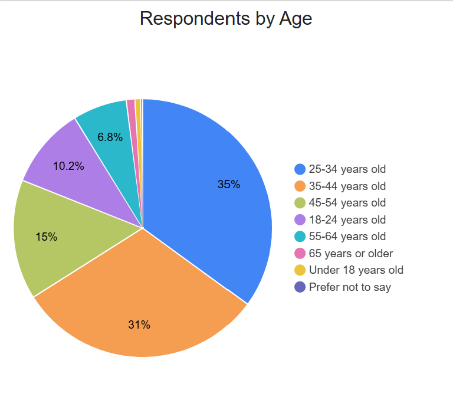
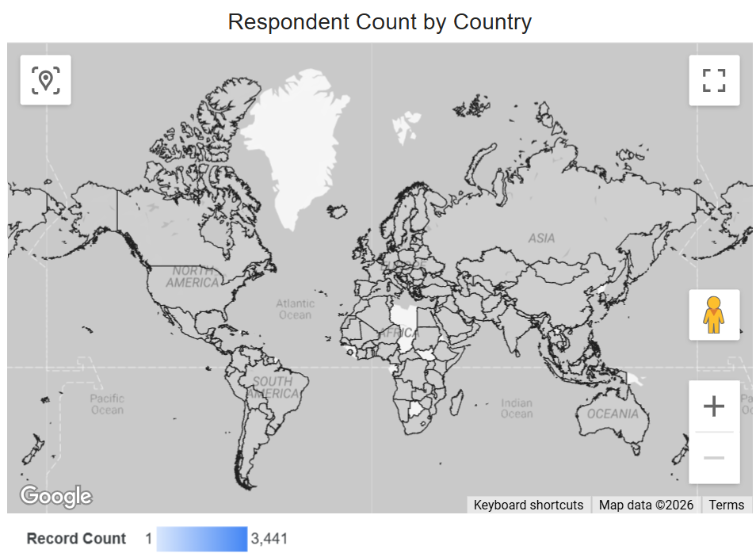
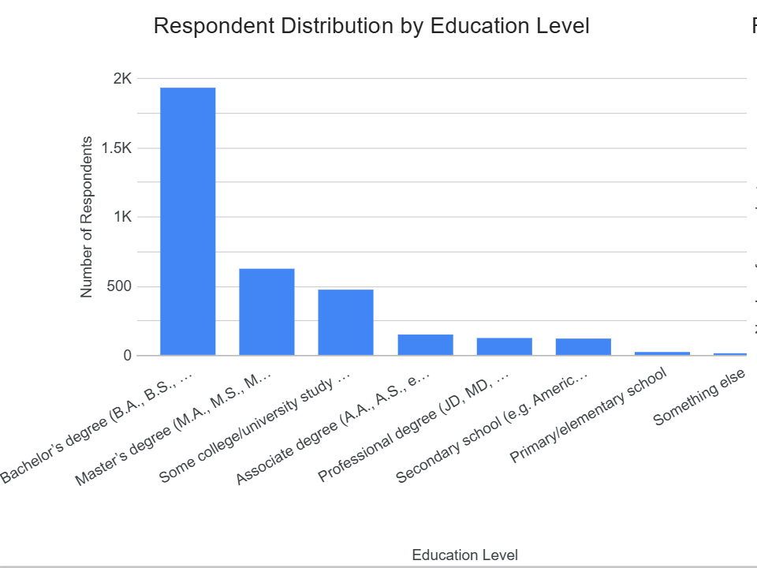
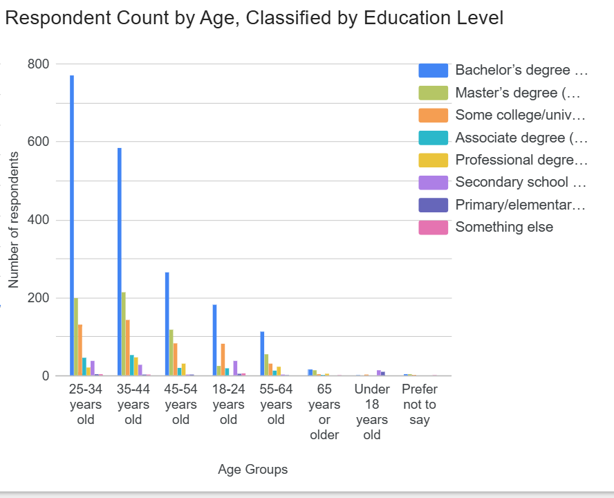
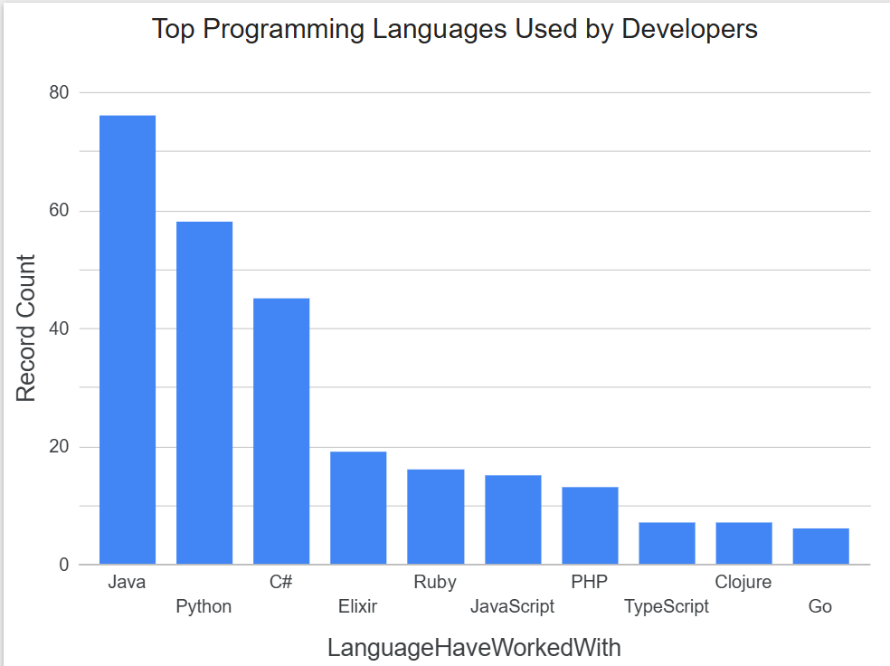
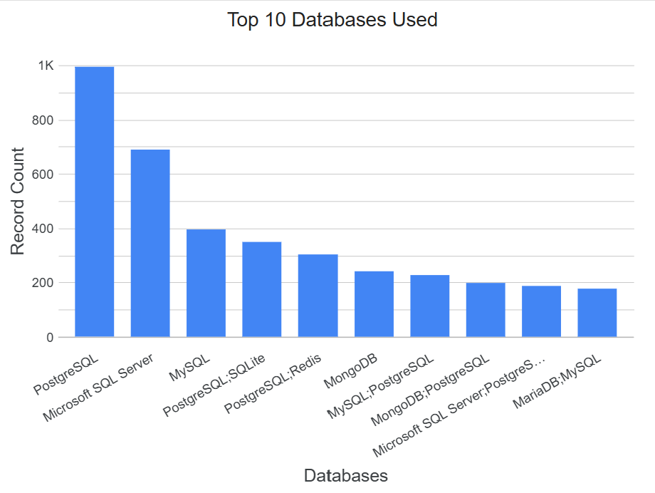
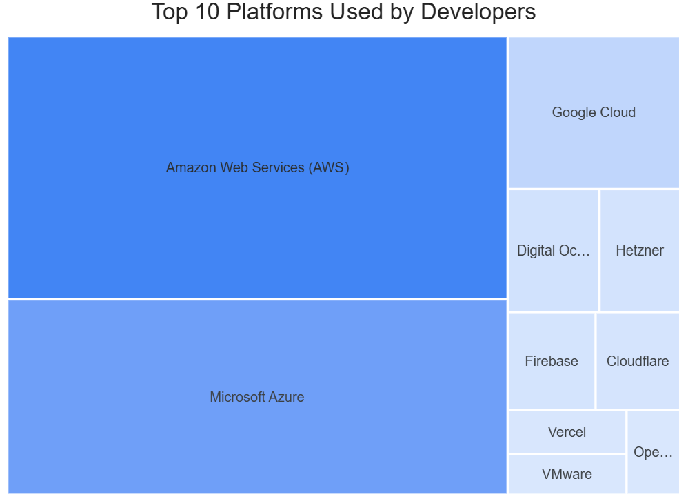
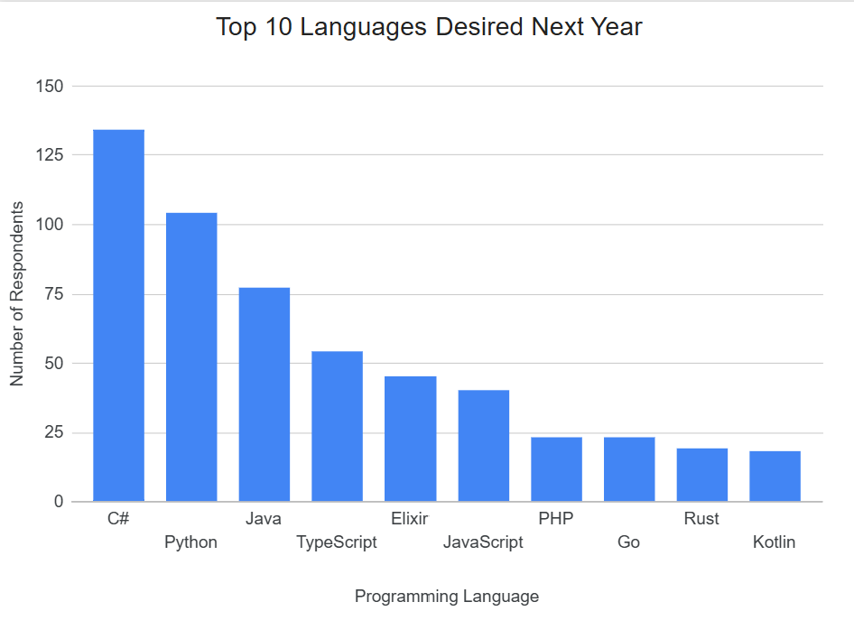
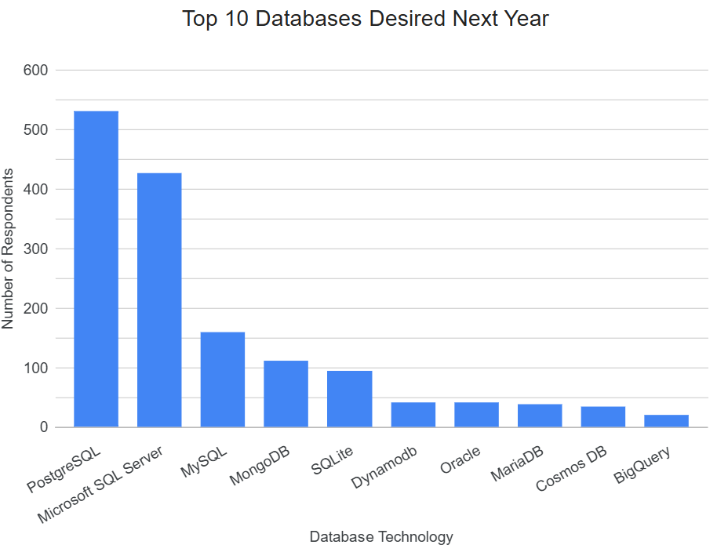
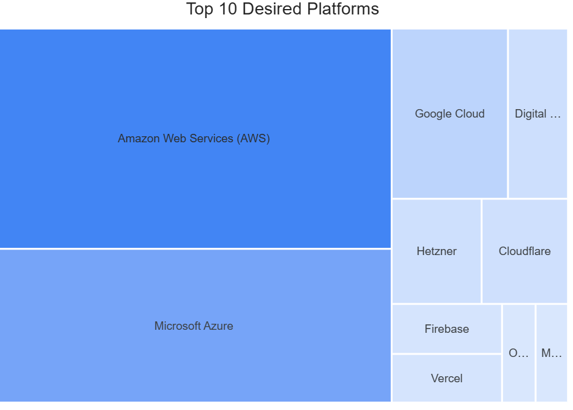

# 📊 Stack Overflow 2024 Looker Studio Dashboard Analysis

This project analyzes the **2024 Stack Overflow Developer Survey (modified dataset)** using interactive dashboards built in **Google Looker Studio**.  
The dashboards explore **current technology usage, future technology trends, and developer demographics**.

The project demonstrates structured data ingestion, multi-select field filtering, and professional dashboard design for analytics reporting.

---

## Dataset

**Source:** Stack Overflow Developer Survey 2024 (IBM Modified Dataset)  
**File:** `survey_results_updated.csv`

Due to file size limits, the raw dataset is not included in this repository.

---

## Objectives

- Identify the most commonly used programming languages, databases, platforms, and web frameworks  
- Analyze future technology trends desired by developers  
- Explore developer demographics by age, country, and education level  

---

## Dashboards & Visualizations

## Dashboards & Visualizations

| Analysis | Preview |
|--------|--------|
| Respondents by Age |  |
| Respondent Count by Country |  |
| Education Level Distribution |  |
| Age Classified by Education Level |  |
| Top 10 Languages Used |  |
| Top 10 Databases Used |  |
| Top 10 Platforms Used |  |
| Top 10 Languages Desired Next Year |  |
| Top 10 Databases Desired Next Year |  |
| Top 10 Desired Platforms |  |
| Top 10 Desired Web Frameworks |  |

---

## Tools & Technologies

- Google Looker Studio  
- CSV Data Source  
- Stack Overflow Developer Survey 2024  

---

## Author

**William Quinby**  
GitHub: https://github.com/BuildsByQuinby  
LinkedIn: https://www.linkedin.com/in/williamquinby/
