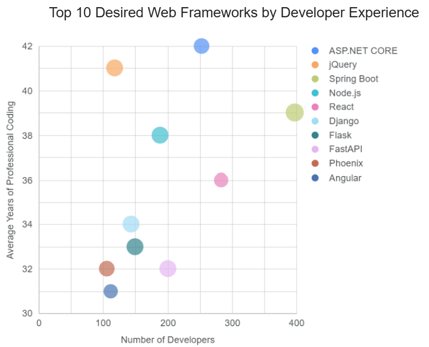

# Stack Overflow Developer Trends Analysis (Looker Studio)

This project analyzes trends in modern software development using Stack Overflow Developer Survey data.  
Interactive dashboards were created in Google Looker Studio to explore programming languages, databases, cloud platforms, and web frameworks.

---

## Dataset

Source: Stack Overflow Developer Survey  
https://cf-courses-data.s3.us.cloud-object-storage.appdomain.cloud/HLOosvsPgIwt5dgOOh1RSg/survey-data-updated.csv  

The dataset is loaded into Looker Studio and used to generate visual dashboards summarizing developer tool usage and preferences.

---

## Objectives

- Identify the most widely used programming languages
- Determine the most popular database technologies
- Analyze cloud platform adoption among developers
- Examine desired web frameworks by developer experience level
- Create clean, interactive dashboards for visual analysis

---

## Visualizations

### Top 10 Programming Languages Used

---

### Top 10 Databases Used

---

### Top 10 Cloud Platforms Used by Developers

---

### Top 10 Desired Web Frameworks by Developer Experience

---

## Key Findings

- JavaScript-based technologies dominate modern development stacks
- PostgreSQL and MySQL remain the most widely used databases
- AWS and Microsoft Azure are the leading cloud platforms
- React, ASP.NET Core, and Spring Boot are the most desired web frameworks
- More experienced developers tend to prefer enterprise-grade and scalable frameworks

---

## Tools & Technologies

- Google Looker Studio – Dashboard creation and visualization  
- Stack Overflow Developer Survey – Primary dataset  
- Data Visualization – Trend and insight analysis  
- GitHub – Portfolio publication

---

## Author

BuildsByQuinby  
https://github.com/BuildsByQuinby
